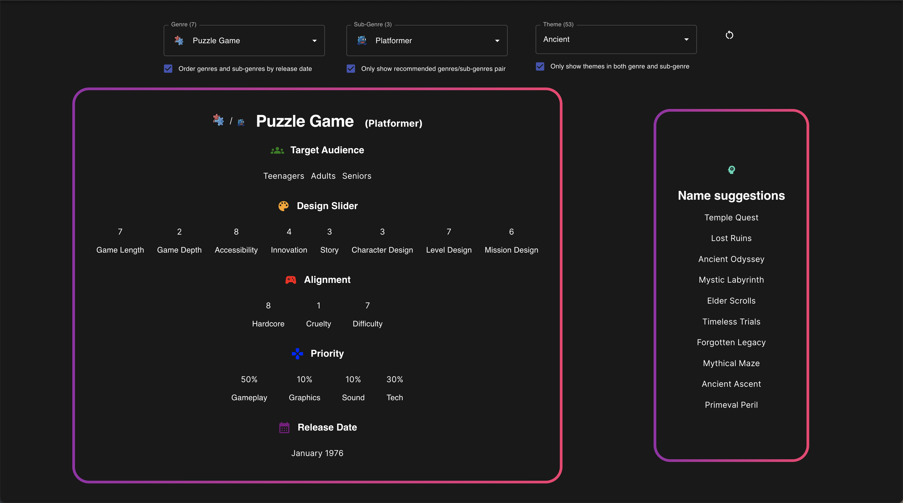

  
  <h1>Mad Games Tycoon 2 - Combo Genius</h1>
  
  

    Find the best combos for your Mad Games!
  

  
  
<!-- Badges -->

  <!--  -->
  
  
  

   
<h4>
    <a href="https://github.com/SpecialAro/mgt2/issues/new?assignees=&labels=bug+%3Abeetle%3A&projects=&template=bug_report.yml">Report Bug</a>
   · 
    <a href="https://github.com/SpecialAro/mgt2/issues/new?assignees=&labels=bug+%3Abeetle%3A&projects=&template=feature_request.yml">Request Feature</a>
  </h4>

 

<!-- Table of Contents -->

# :notebook_with_decorative_cover: Table of Contents

- [About the Project](#star2-about-the-project)
- [Screenshots](#camera-screenshots)
- [Contact](#handshake-contact)

<!-- About the Project -->

# :star2: About the Project

This is the public repository for the [MGT2 Combo Genius](https://mgt2.specialaro.com) website. To report an issue or ask for a new feature please follow the templates [here](https://github.com/SpecialAro/mgt2/issues/new/choose).

A special thank you to [@Chronosuniverse](https://steamcommunity.com/id/ChronosUniverse) that made this [awesome guide](https://steamcommunity.com/sharedfiles/filedetails/?id=2730524852) that served as the foundation for this tool.

<!-- Screenshots -->

# :camera: Screenshots

 
  

<!-- Contact -->

# :handshake: Contact

  

  [André Oliveira (@specialaro)](https://gihub.com/SpecialAro)

  Project Link: [https://github.com/specialaro/mgt2](https://github.com/specialaro/mgt2)

